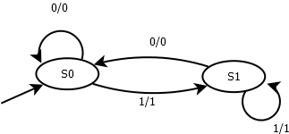
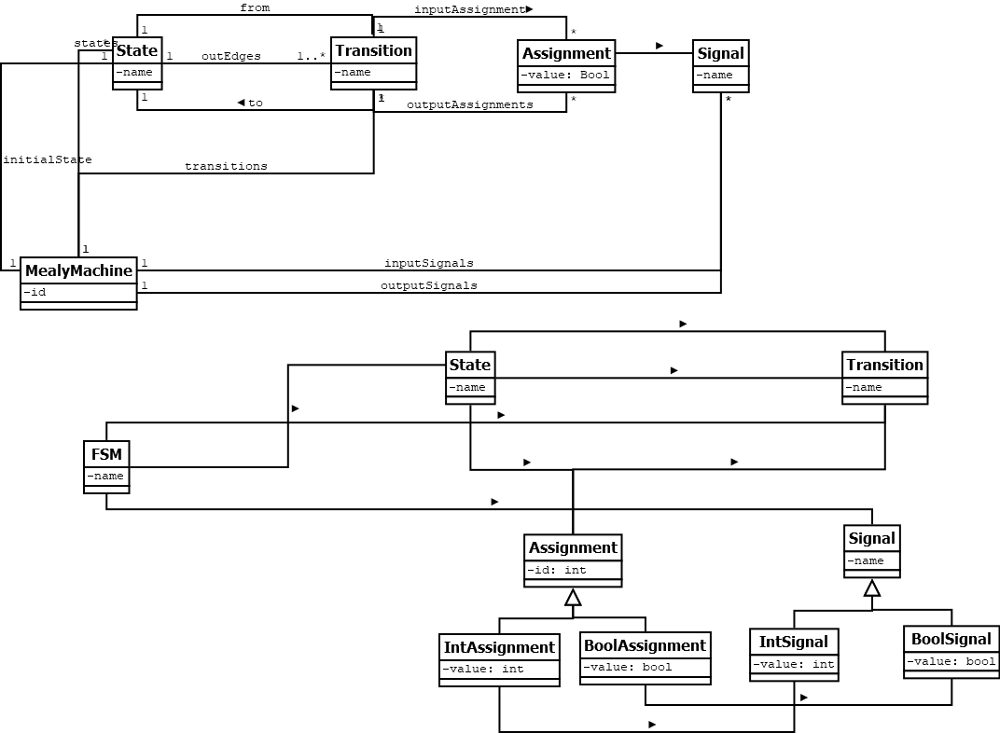

# MM2SMV CONVERTER: From a Mealy Machine to a (Nu)SMV model

## Design Requirement Specification Document

DIBRIS – Università di Genova. Scuola Politecnica, Corso di Ingegneria del Software 80154

 <b> Authors </b>  Massimo Narizzano 

### REVISION HISTORY

Version | Data | Author(s)| Notes
---------|------|--------|------
1.0 |22/04/2022 | Massimo Narizzano | Created the template.
1.1 |23/04/2022 | Massimo Narizzano | Updated the Introduction. 

## Table of Content

1. [Introduction](#intro)
    1. [Purpose and Scope](#purpose)  
    2. [Definitions](#def)
    3. [Document Overview](#overview)
    4. [Bibliography](#biblio)
2. [Project Description](#description)
    1. [Project Introduction](#project-intro)
    2. [Technologies used](#tech)
    3. [Assumptions and Constraints](#constraints)
3. [System Overview](#system-overview)
    1. [System Architecture](#architecture)
    2. [System Interfaces](#interfaces)
    3. [System Data](#data)
        1. [System Inputs](#inputs)
        2. [System Outputs](#outputs)
4. [System Module 1](#sys-module-1)
    1. [Structural Diagrams](#sd)
        1. [Class Diagram](#cd)
            1. [Class Description](#cd-description)
        2. [Object Diagram](#od)
        3. [Dynamic Models](#dm)
5. [System Module 2](#sys-module-2)
   1. ...

##    1 Introduction

    
 The design specification document reflects the design and provides directions to the builders and coders of the product.
 
    Through this document, designers communicate the design for the product to which the builders or coders must comply. The design specification should state how the design will meet the requirements.

    
###  1.1 Purpose and Scope

 
    
 This document gives a detailed description of the software architecture of the translator from a Mealy Machine to a NuSMV model 

 This document specifies the architecture as wel as the input and output format of the systems. It also displays some algorithm to translate mealy machines to NuSMV morels, use sequence or activity diagrams. The class diagrams show how the programming team would implement the specific module.
    This document is intended for developers.
    

###  1.2 Definitions

 
    
 In this section are described some of the notions given for granted in the remaining of the document, as well as some acronyms used.
    

       
| Acronym  | Defonition |
| ------------- | ------------- |
| Mealy Machine | Content Cell  |
| MM | Content Cell  |
| NuSMV  | Content Cell  |
| SMV  | Content Cell  |
| UML | Content Cell  |
    
    

###  1.3 Document Overview

 
    
 The remaining of the document is organized as follow: 

    
 Section 2 gives a high level decrption of the project, the techologies used and the constraints; Section 3 gives a system architecture overview, where system should be divided in separated modules, with also the description of the system interfaces and inputs/outputs; each section after the section 3 is devoted, if any, to each module, i.e. a section for each module. In this case Section 4 describe through UML diagrams the first and unique module. It describe the static structure of the system using class diagram and object diagram to give an example. Moreover it also describe dynamic system behaviours 

###  1.4 Bibliography

 
    
 Put a summary of the section
    

    
This sub section should describe ...

##  2 Project Description

###  2.1 Project Introduction 

 
    
 Goal of this project is to develop a translator from a mealy machine to a kripke structure in SMV format.
    

    
 Both MM and Kripke Structures are Finite State Machines. The main differences between them are ..... 

###  2.2 Technologies used

     
    
 Put a summary of the section
    

    
This sub section should describe ...

###  2.3 Assumption and Constraint 

 
    
 Put a summary of the section
    

    
This sub section should describe ...

##   3 System Overview

 
    
 Put a summary of the section
    

    
This sub section should describe ...

###   3.1 System Architecture

 
    
 Description of the overall architecture. 

    

        Graphical representation of the system architecture.  May be composed by multiple diagrams depending on the differences in the environment
specifications    
    

###   3.2 System Interfaces

 
    
 Put a summary of the section
    

    
This sub section should describe ...

###   3.3 System Data

 
    
 Put a summary of the section
    

    
This sub section should describe ...

####   3.3.1 System Inputs

 
    
 Put a summary of the section
    

    

    Three different types of inputs 
    
    - Mealy Machine : should be provided as a file following the <a href="https://graphviz.org/doc/info/lang.html" target="_blank"> graphviz dot language</a>
    

    As an example
    
    digraph {
   
    init [style = invis]
    
    S0
    
    S1
    
    init -> S0
    
    S0 -> S1 [label="0/0"]
    
    S1 -> S0 [label="1/1"]
    
    S0 -> S0 [label="1/1"]
 
    S1 -> S1 [label="0/0"]

}
    
    

 - Input Signals : should be formatted as a list of names comma separated, for example : a,b,c,f4,f_5,... 
    
 - Output Signals : should be formatted as a list of names comma separated, for example : a,b,c,f4,f_5,... 
    
 We can not have a signal names that is in Input Signals list and Output signals list at the same time.
       

####   3.3.2 System Ouputs

 
    
 Put a summary of the section
    

    
The output of the system must be a file formatted with <a href="https://nusmv.fbk.eu/NuSMV/userman/v21/nusmv_3.html" target="_blank"> NuSMV format</a>

    
    

##   4 System Module 1

 
    
 Put a summary of the section
    

    
This sub section should describe ...

###   4.1 Structural Diagrams

 
    
 Put a summary of the section
    
 
    
 This sub section should describe ....

    

####   4.1.1 Class diagram

 
    
 Put a summary of the section
    

    
This sub section should describe ...

    

#####   4.1.1.1 Class Description

 
    
 Put a summary of the section
    

    
This sub section should describe ...

####   4.1.2 Object diagram

 
    
 Put a summary of the section
    

    
This sub section should describe ...

####   4.2 Dynamic Models

 
    
 Put a summary of the section
    

    
This sub section should describe ...

